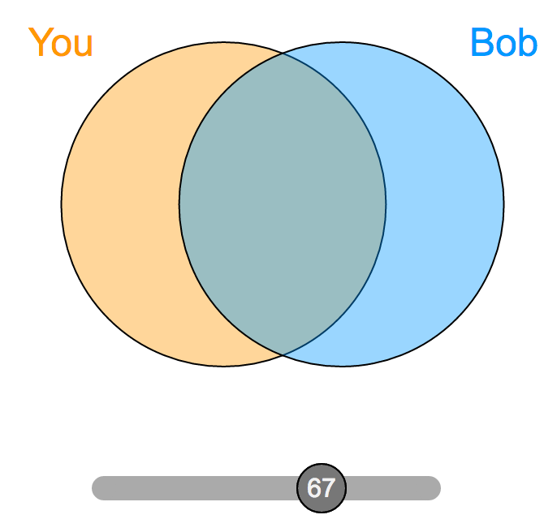

# psychWidgets

This repository contains useful psychology-related javascript widgets. Each widget comes with its own documentation, just navigate into the folder using the directory structure above.

Questions or comments should be directed to desmond (dot) ong (at) stanford (dot) edu

## Contents

- IOS_slider: A continuous (100-point) version of the Inclusion of Other in Self (IOS) scale (Aron, Aron, & Smollan, 1992)   
- scalar_slider_template: A simple 100-point slider based off jquery UI for web experiments. (It's a generalization of IOS_slider)

- continuous_time_slider: A simple experiment with a slider, that records the value of the slider every X seconds, and saves the vector as a variable. 
  - I have also included a version that allows integration into Qualtrics, a Matlab version, and a Psychopy version in this folder as well.
